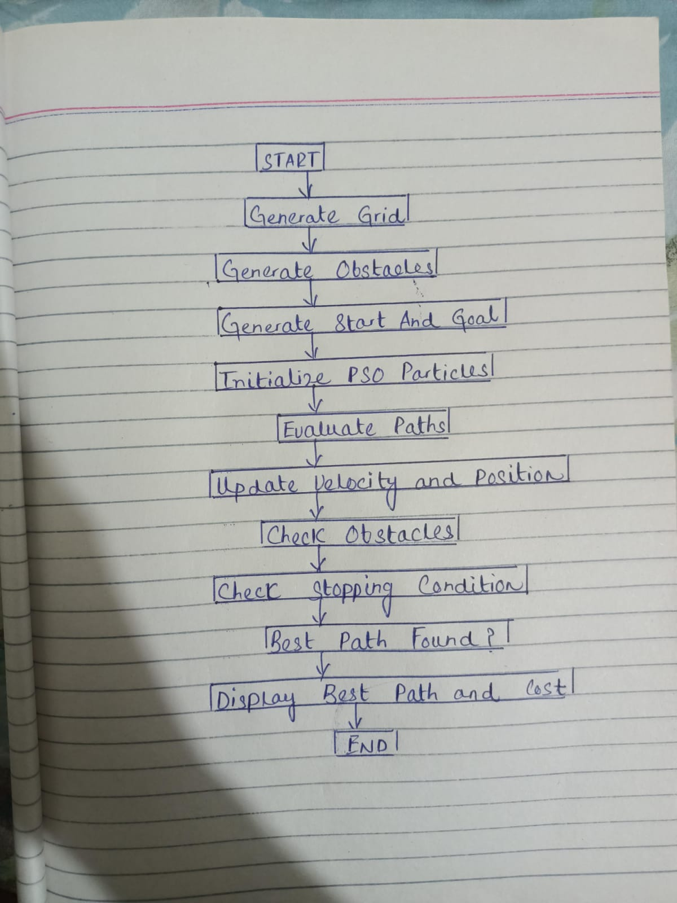

# Swarm-Based Path Planning with Obstacles

## Student Information

**Name:** Usama Afzal  
**Roll Number:** 01-136232-074  
**Random Seed:** 136232074  

## Project Description

This project implements Particle Swarm Optimization (PSO) for path planning in a 2D grid environment with randomly generated obstacles.

The grid, obstacles, start point, and goal point are generated programmatically using the student's roll number as the random seed.

## Problem Setup

- Grid Size: 20 × 20
- Number of Obstacles: 80
- Start Point: (19, 5)
- Goal Point: (13, 17)
- Random Seed: 136232074

## Approach

The PSO algorithm uses particles to search for a path from the start point to the goal point. Each particle represents a possible sequence of movements. The particles update their positions based on their own best solution and the global best solution.

The cost function considers the distance from the goal, path length, and invalid movements caused by obstacles or grid boundaries.

## Results

The best solution found by the algorithm reached the goal without invalid moves.

- Best Cost: -945.86
- Path Positions: 51
- Invalid Moves: 0
- Final Position: (13, 17)

## Flow Diagram

## How to Run

1. Open the provided Google Colab notebook.
2. Run the cells in order.
3. The grid and obstacles are generated using the specified seed.
4. The PSO algorithm searches for a path.
5. The final path and its cost are displayed using Matplotlib.
## Final Output

The PSO algorithm successfully found a path from the start point to the goal point.

The final solution reached the goal at (13, 17) with 0 invalid moves. The resulting path contains 51 positions.
